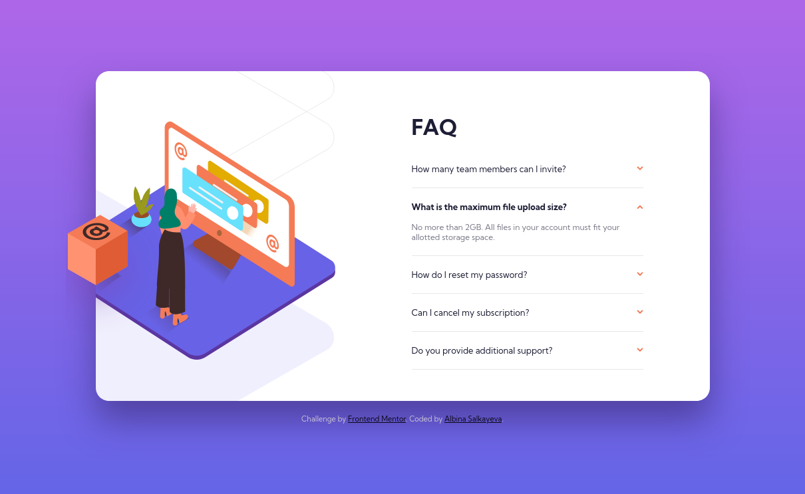
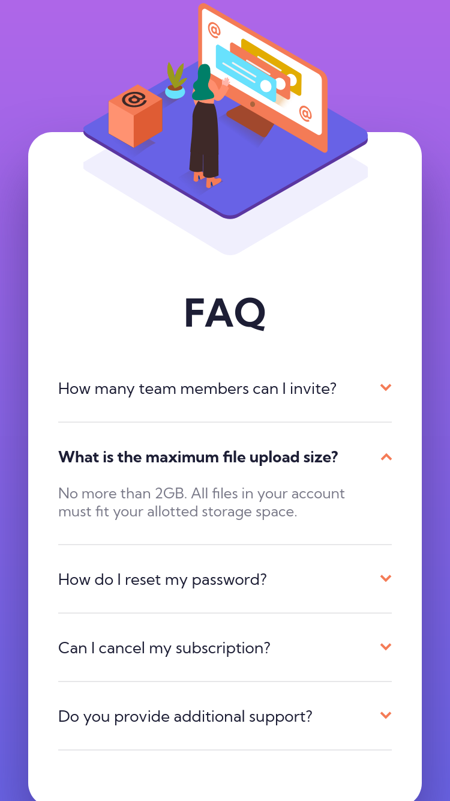

# Frontend Mentor - FAQ accordion card solution

This is a solution to the [FAQ accordion card challenge on Frontend Mentor](https://www.frontendmentor.io/challenges/faq-accordion-card-XlyjD0Oam). Frontend Mentor challenges help you improve your coding skills by building realistic projects.

## Table of contents

- [Overview](#overview)
  - [The challenge](#the-challenge)
  - [Screenshots](#screenshots)
  - [Links](#links)
- [My process](#my-process)
  - [Built with](#built-with)
  - [What I learned](#what-i-learned)
- [Author](#author)

## Overview

### The challenge

Users should be able to:

- View the optimal layout for the component depending on their device's screen size
- See hover states for all interactive elements on the page
- Hide/Show the answer to a question when the question is clicked

### Screenshots

| Desktop                            | Mobile                             |
| ---------------------------------- | ---------------------------------- |
|  |  |

### Links

- Solution URL: [https://github.com/albina0104/faq-accordion-card](https://github.com/albina0104/faq-accordion-card)
- Live Site URL: [https://albina0104.github.io/faq-accordion-card/](https://albina0104.github.io/faq-accordion-card/)

## My process

### Built with

- Semantic HTML5 markup
- Sass
- Mobile-first workflow
- Completed the challenge without using JavaScript

### What I learned

How to make sure the markers of the `<summary>` elements are hidden in all browsers:

```scss
summary {
  list-style-type: none;

  &::marker,
  &::-webkit-details-marker {
    display: none;
  }
}
```

## Author

- Frontend Mentor - [@albina0104](https://www.frontendmentor.io/profile/albina0104)
- GitHub - [albina0104](https://github.com/albina0104)
